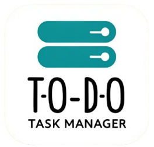
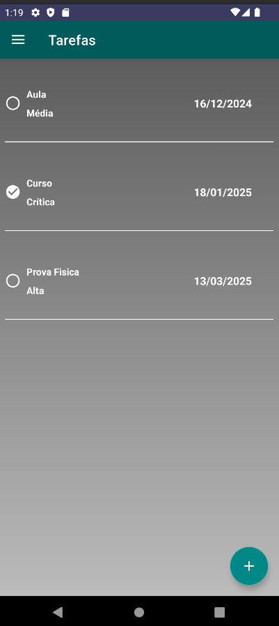
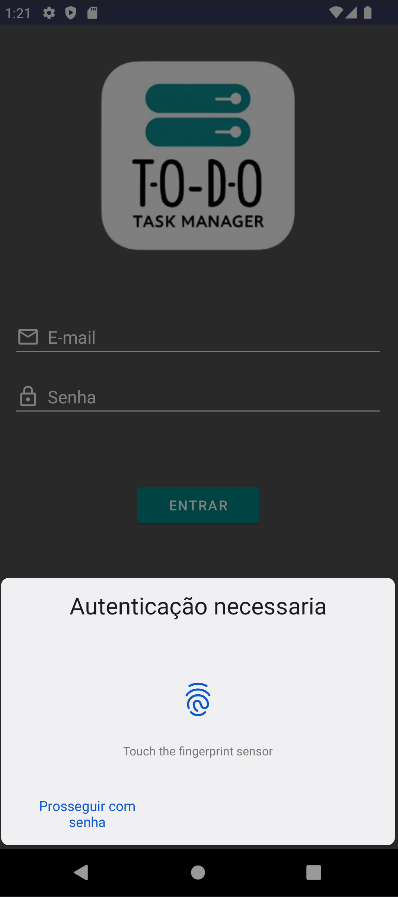
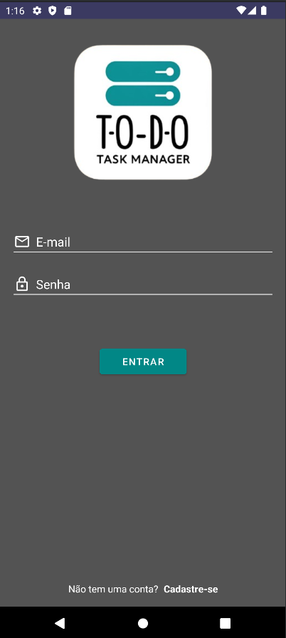
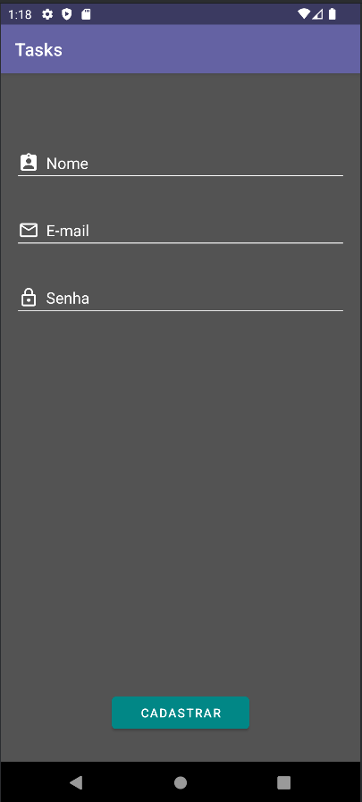
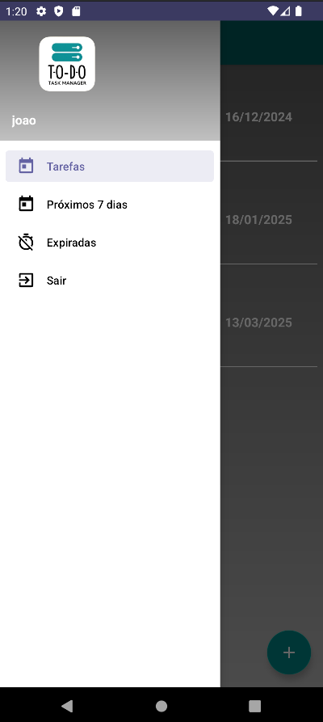
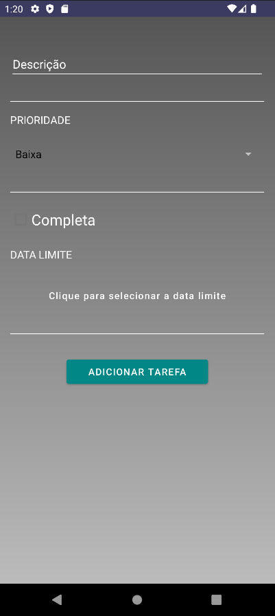

# TasksTODO Application    

## Descrição
O **TasksTODO** é um aplicativo intuitivo e funcional para gerenciamento de tarefas. Com uma interface amigável e recursos de segurança, ele é perfeito para organizar e acompanhar suas atividades diárias.

---

## Funcionalidades
- Cadastro e edição de tarefas com descrição, prioridade e data limite.
- Filtragem de tarefas: todas, próximas ou vencidas.
- Autenticação biométrica para proteção adicional.
- Login e registro de usuários.
- Interface limpa e adaptada para dispositivos móveis.

---

## Ferramentas e Tecnologias Utilizadas
- **Linguagem de Programação**: Kotlin
- **Arquitetura**: MVVM (Model-View-ViewModel)
- **Interface do Usuário**: Android Jetpack Components
    - ConstraintLayout
    - RecyclerView
    - LiveData
    - ViewModel
    - Navigation Component
- **Bibliotecas**:
    - Retrofit para consumo de APIs.
    - BiometricPrompt para autenticação biométrica.
    - Glide para carregamento de imagens.
    - Material Components para UI moderna.

---

## Como Executar

1. **Clone o Repositório**:
   ```bash
   git clone https://github.com/seu-usuario/tasks-todo.git
   ```

2. **Abra o Projeto no Android Studio**:
   - Certifique-se de que você possui o Android Studio instalado.
   - Abra o diretório do projeto clonado.

3. **Configure um Emulador ou Dispositivo Físico**:
   - Certifique-se de ter um emulador Android configurado no Android Studio ou um dispositivo físico conectado via USB com a depuração USB ativada.

4. **Compile e Execute**:
   - Clique no botão "Run" no Android Studio ou utilize o atalho `Shift + F10`.

5. **Dependências Necessárias**:
   - Certifique-se de que o projeto instalou corretamente as dependências necessárias no arquivo `build.gradle`.

---

## Capturas de Tela

| Tela 1                   | Tela 2                   | Tela 3                   |
|--------------------------|--------------------------|--------------------------|
|  |  |  |

| Tela 4                   | Tela 5                   | Tela 6                   |
|--------------------------|--------------------------|--------------------------|
|  |  |  |


---

## Licença
Este projeto está sob a licença MIT. Para mais detalhes, leia o arquivo `LICENSE` no repositório.
```
